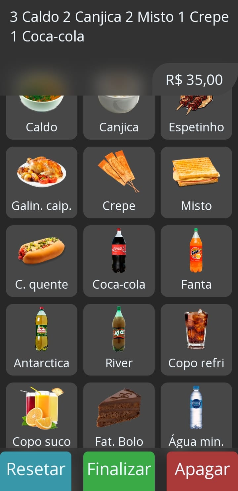
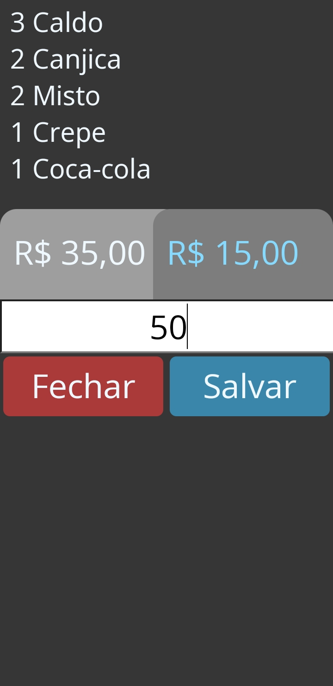
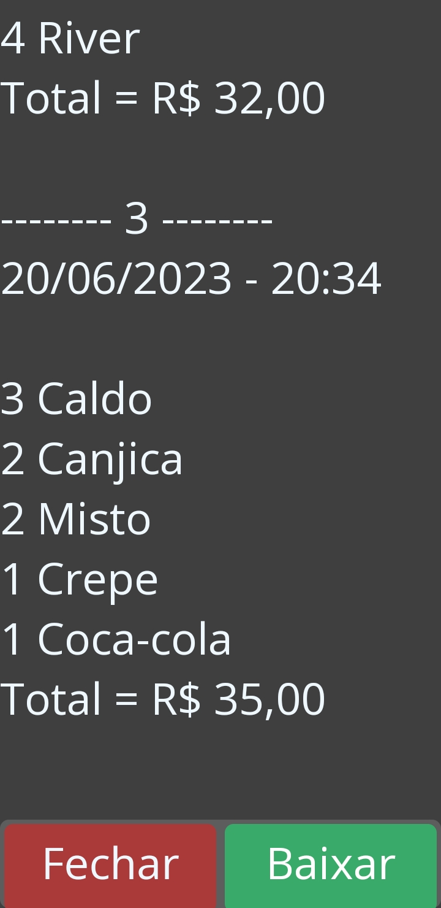

# App de pedidos

### Esse app é um **Web App** simples com funções que ajudam quem vende com dinheiro, facilitando também no troco

<table>
  <tr>
    <td>
        
    </td>
    <td>
        
    </td>
    <td>
        
    </td>
    <td>
        
    </td>
  </tr>
</table>

Esse app foi desenvolvido com o intuito de resolver uma dor que percebi durante eventos festivos na igreja, onde haviam varias opções de vendas com vários preços diferentes, muitas pessoas para atender e muitas vezes os pedidos que as pessoas faziam eram estensos dificultando ainda mais a venda e o cálculo para o troco da mesma.

Vendo isso tive a ideia de criar esse app que solucionace essa dor, onde: 
 - Possui toda a lista de itens a venda (*podendo quem está vendendo consultar a lista caso esqueça de algo*)
 - Ao clicar em um item da lista o item é mostrado na janela superior e é mostrado por quantidade (*facilitando a visualização de pedidos longos*), e ao mesmo tempo o valor do pedido já é calculado e mostrado (*evitando do vendedor ter que fazer o cálculo do total, ajudando bastante em pedidos longos*)
 - Possui botão de **Apagar** item caso não queira o item no pedido e o botão de **Resetar** para apagar todo o pedido.
 - Ao clicar em **Finalizar** abrirá uma nova janela no qual aparecerá os itens pedidos e o total de forma mais clara, e um campo para a inserção do valor recebido, que quando digitado esse valor, automaticamente é mostrado o valor do troco, ao lado do total, que deve ser dado ao cliente.
 - Além disso tem a função de salvar os pedidos em um histórico que salva a data, hora, itens e valor total do pedido (*esse histórico pode ser acessado digitando na caixa do valor recebido o código `4321` e para apagar todo o historico você pode digitar o código `0000000000000`*).
 - Ao clicar e segurar por 3 segundos encima de um item, ele é apagado da lista (*caso algum item tenha acabado e queira remove-lo, e para voltar os itens apagados para a tela novamente basta digitar o código `11111`*).

Espero que tenha gostado dessa ideia e quero com o tempo melhorar esse projeto. Você pode acessar o app funcionando por esse link  (*caso abra o link pelo PC ele não está adptado para funcionar neles, mas você pode redimencionar a janela para que veja de forma correta*)

