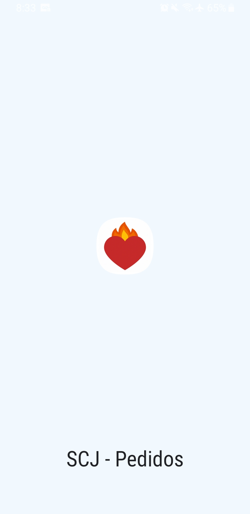
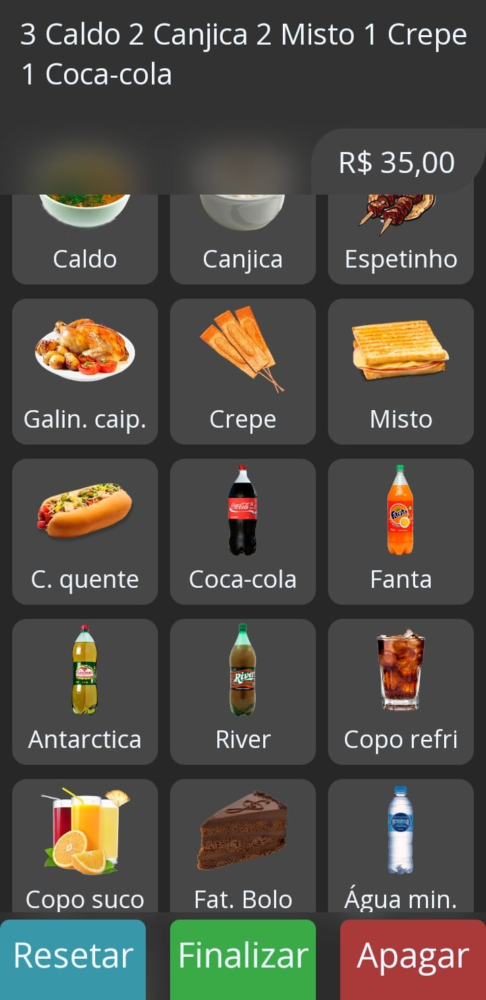
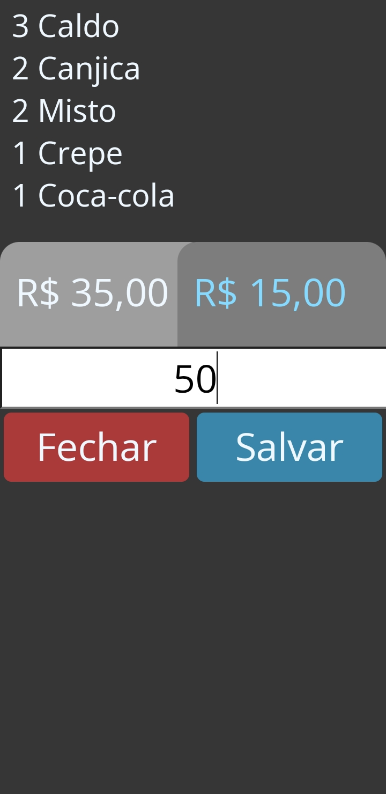
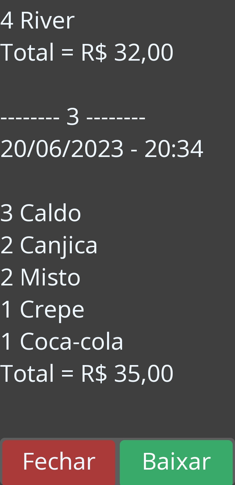

# App de pedidos

### Um **Web App** simples para quem vende com dinheiro em eventos: monta o pedido, soma o total e calcula o troco

<table>
  <tr>
    <td></td>
    <td></td>
    <td></td>
    <td></td>
  </tr>
</table>

Esse app nasceu de uma dor que percebi nos eventos festivos da igreja: muitas opções de venda com preços diferentes, muita gente para atender e pedidos longos, o que dificultava somar o total e calcular o troco.

## Como usar

- **Toque nos itens** para montar o pedido. O topo mostra cada item com a quantidade e o total já somado; cada card mostra quantas unidades estão no pedido.
- **Apagar** tira o último item tocado. **Resetar** limpa o pedido (aparece um botão "Desfazer" por alguns segundos).
- **Finalizar** abre o resumo. Digite o valor recebido ou toque nas notas (+2, +5, +10, +20, +50, +100, "Exato") e o troco aparece na hora (ou quanto falta, em vermelho).
- **Salvar** guarda o pedido no histórico com data, hora, itens, valor recebido e troco.
- O pedido em andamento não se perde se o app fechar ou o celular reiniciar.

## Menu secreto

**Toque 5 vezes rápido no topo da tela** (área do pedido). O menu tem três abas:

- **Resumo** — total arrecadado, número de pedidos, itens vendidos, ticket médio e o ranking de vendas por item. Botões para baixar ou compartilhar o relatório (.txt) e para zerar o histórico no começo de um novo evento.
- **Pedidos** — todos os pedidos salvos. "Desfazer último pedido" tira o último do histórico e devolve os itens para a tela (para corrigir). Também dá para excluir qualquer pedido.
- **Itens** — liga/desliga cada item. O que estiver desligado (esgotado) some da tela de vendas.

## Dados

Tudo fica salvo **no próprio aparelho** (IndexedDB), funciona sem internet e não vai para nenhum servidor. Cada celular tem o seu próprio histórico. Na primeira abertura desta versão, o histórico da versão antiga é importado automaticamente.

## Para quem mantém o app

- **Cardápio e preços:** `script/cardapio.js`. Imagens em `images/alimentos/` (WebP, ~256 px).
- **Ao publicar qualquer mudança**, aumente a `VERSAO` em `sw.js`, senão os celulares que já instalaram o app continuam com a versão antiga.
- Sem build: é só HTML, CSS e JavaScript (módulos ES). Para testar no computador, rode um servidor local (ex.: `python3 -m http.server`) e abra `http://localhost:8000` — abrir o `index.html` direto não funciona por causa dos módulos.

| Arquivo | O que faz |
| --- | --- |
| `script/app.js` | Tela principal e finalizar pedido |
| `script/menu.js` | Menu secreto (resumo, pedidos, itens) |
| `script/db.js` | Banco local (IndexedDB) |
| `script/relatorio.js` | Totais e arquivo do relatório |
| `script/migracao.js` | Importa o histórico da versão antiga |
| `script/ui.js` | Telas, confirmações e avisos |
| `script/dinheiro.js` | Formatação de valores (em centavos) |

Acesse o app: [elvisalmeida.com.br](https://elvisalmeida.com.br/)
